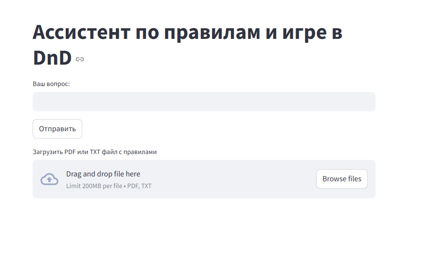
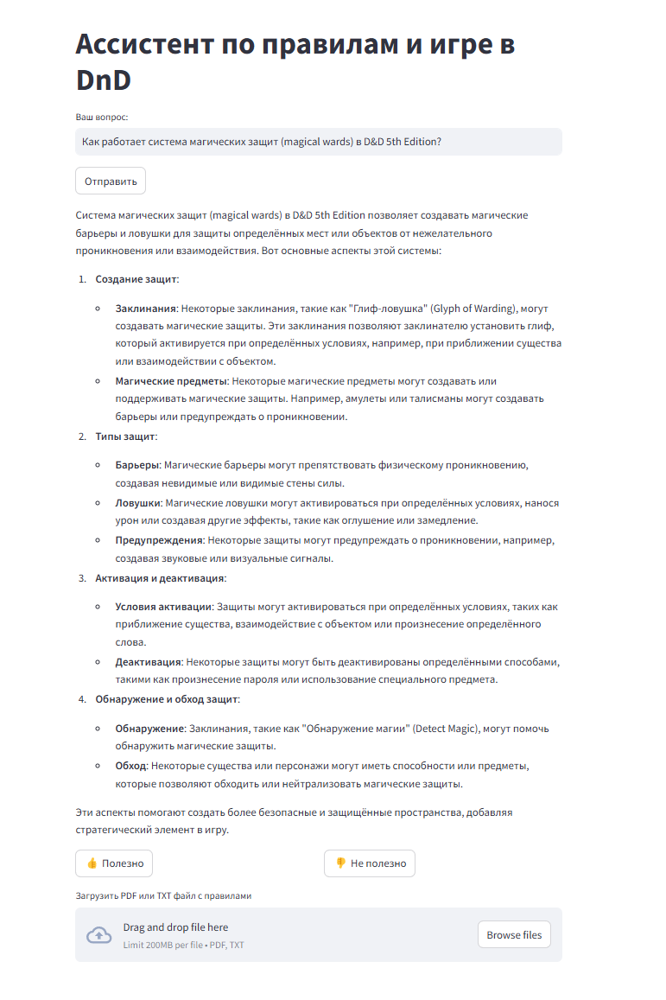
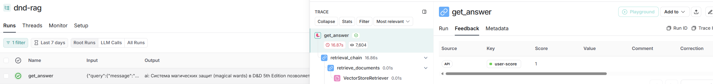
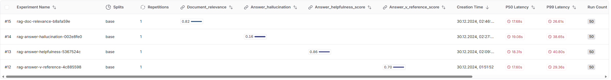

# DnD-Assistant

## Cостав команды

- Илья Голдобин
- Александр Ворхлик

## Описание

RAG ассистент, который использует Mistral AI для ответов на вопросы о правилах DnD.

## Источники данных

- Руководство мастера - 5-я редакция DnD
- Книга игрока - 5-я редакция DnD
- Данные пользователя (есть возможность добавить свой рулбук/приключение)

## Как запустить

Для использования `make` необходимо работать в Linux либо в WSL2 на windows

1. `make build`

2. `cp fastapi/.env.example fastapi/.env`

    Заполните переменные своими api ключами

3. `cp test/.env.example test/.env`

    Заполните переменные своими api ключами

    Укажите имя для датасета загружаемого в LangSmith

4. `cp streamlit/.env.example streamlit/.env`

    Ничего заполнять не нужно

5. `make up`

    Для запуска *fastapi* и *streamlit*

6. `make test-up`

    Для запуска *fastapi* и валидации

## Пример интерфейса

Добавлены кнопки для обратной связи пользователя, которые логгируются в LangSmith

Отображение обратной свзяи в LangSmith

## Валидация

### Датасет

1. dataset.json
    
    50 пар вопрос-ответ сгенерированы с помощью Mistral, постобработка не проводилась

### Загрузка датасета

`make test-dataset-upload`

Будут загружены данные из *dataset.json* в датасет с именем *DATASET_NAME*, указанным в *.env* файле

### Запуск валидации

`make test-up`

### Результаты валидации

| Document Relevance | Answer Hallucination | Answer Helpfulness | Answer vs Reference |
|:-------------------|:--------------------|:-------------------|:--------------------|
| 0.82               | 0.16                | 0.86               | 0.70                |

Низкое значение Answer Hallucination вызвано тем, что датасет полностью синтетический, модель сгенерировала короткие ответы без подробностей, в то время как RAG система дает более подробные и полные ответы, которые не входят в рамки синтетических референсных ответов, из-за чего большая часть ответов RAG получила нулевой скор

